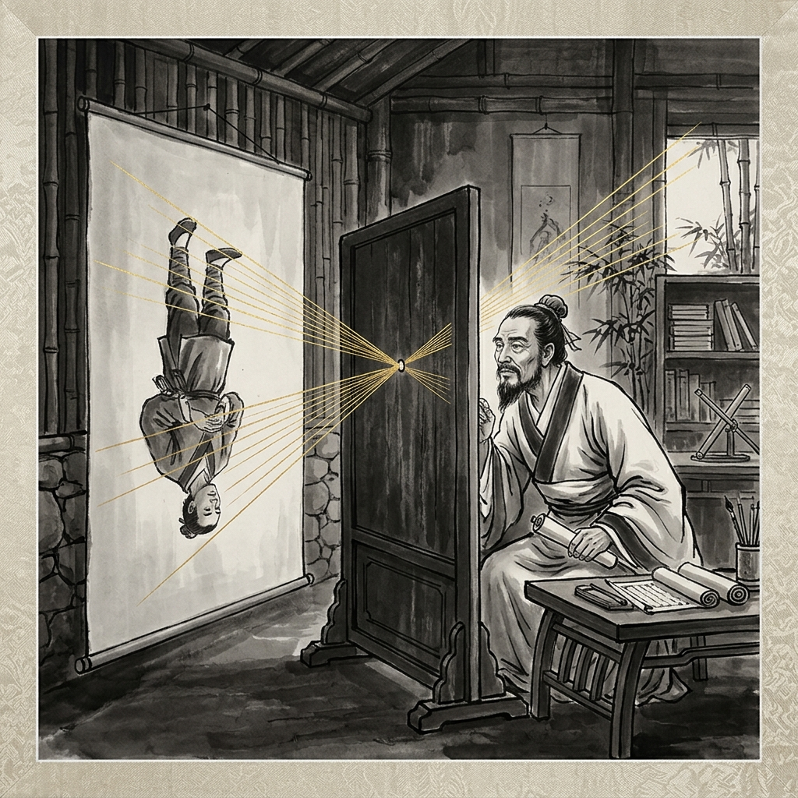

# Part 1: 平行的时空与错失的范式（17世纪前）

> *"景：光之人，煦若射。下者之人也高，高者之人也下。"* —— 《墨子·经下》

## 世界轴 (World Axis)
在17世纪之前，西方物理学（或更准确地说是自然哲学）的发展以古希腊的亚里士多德（公元前384年—公元前322年）体系为核心。亚里士多德的《物理学》并非现代意义上的定量科学，而是一门关于自然变动、运动和存在的定性哲学。他构建了一个宏大的宇宙模型：宇宙是有限的、球形的，以地球为中心。月球以下的世界由水、火、气、土四种元素组成，它们各自有其“自然位置”，运动是事物寻找其自然位置的倾向（如重物下落，轻物上升）。而月球以上的世界则由完美的第五元素“以太”组成，进行永恒的圆周运动。

亚里士多德的物理学是目的论的，他认为自然界的一切变化都有其目的。他提出了“四因说”：质料因、形式因、动力因和目的因。在解释物体运动时，他强调必须有持续的推力才能维持运动，这导致了对“强迫运动”的复杂解释。这一体系统治了西方思想界一千多年，与基督教神学完美融合，成为中世纪经院哲学的核心。

然而，亚里士多德体系内部存在着张力。16世纪，哥白尼提出日心说，从根本上挑战了亚里士多德的宇宙学基础。随后，第谷的精确天文观测、开普勒的行星运动三定律，以及伽利略使用望远镜的发现，一步步瓦解了亚里士多德的完美水晶球宇宙。伽利略对自由落体和抛体运动的研究，开始引入定量实验与数学描述，揭开了近代科学革命的序幕。这一时期的“世界轴”正在经历从古希腊的定性自然哲学向近代定量实验科学的惊人转向。

## 中国点 (China Point)
与此同时，中国在古代发展出了极其丰富的经验物理知识，展现出独特的实用主义与有机自然观。

在力学和光学方面，《墨经》（成书于战国时期，约公元前4世纪，墨子约公元前470年—公元前391年）是璀璨的明珠。《墨经》中包含着大量关于力学、光学和几何学的讨论，其科学性在同时代的世界范围内都是罕见的。例如，它对力的定义是“力，形之所以奋也”（力是使物体运动状态发生改变的原因），这与两千年后牛顿第一定律的内涵有某种微妙的契合。在光学方面，《墨经》详细记录了光线直线传播、小孔成像（倒像的形成）、平面镜、凹面镜和凸面镜的反射成像规律，其细致程度令人叹为观止。

在声学和磁学方面，中国古代的成就更是领先世界。指南针的发明和应用是中国对世界文明的重大贡献。早在战国时期就有“司南”的记载，到了宋代，沈括在《梦溪笔谈》中不仅记录了指南针的制作方法，还首次发现了“地磁偏角”（磁针并非绝对指向正南，而是略有偏角），这比西方早了四百年。在声学上，古代中国对乐律的研究深入，战国时期的曾侯乙编钟展现了高超的铸造技术与对共鸣、双音的深刻理解。

然而，这些卓越的知识多散见于各类典籍、技术笔记或方术著作中，未能形成像亚里士多德物理学那样逻辑严密、体系完整的理论架构。中国古代的自然观更偏向于有机自然论与整体论，强调阴阳五行、气论以及“天人合一”。在这种范式下，自然被视为一个相互关联的有机整体，而非可以拆解研究的机械钟表。

## 坐标值 (Coordinate Value)
从“世界轴-中国点”的坐标系来看，17世纪前的中西物理发展处于一种“平行时空”的状态。

中国在许多具体的经验发现与技术发明上处于领先地位，如磁学的应用与光学的经验观察。然而，中国文化传统中缺乏古希腊的形式逻辑与公理化数学（如欧几里得《几何原本》所代表的体系）。古希腊人热衷于从少数公理出发，通过严密的逻辑推理得出结论，构建起坚实的理论大厦。而中国古代数学则更偏向于实用算法，如《九章算术》，解决的是具体的土地测量、赋税计算等问题，缺乏抽象的逻辑证明传统。

这使得中国的经验知识未能转化为近代系统性的实验科学。中国的科学探索更多是由实用需求驱动的（如历法、冶金、航海），而不是由纯粹的求知欲以及对宇宙终极规律的数学化追求驱动的。

因此，中国错失了近代物理学范式的诞生，并非因为中国人的智力不足，而是因为其独特的文化与思想范式导向了不同的发展路径。当西方开始将数学与实验结合，走向还原论与机械论的近代科学之路时，中国依然在有机论与经验主义的轨道上平稳运行。这种“平行”最终在17世纪后导致了巨大的“视差”。

## Content
### 第一章：古代的物理智慧与经验积累

#### 第一节：《墨经》中的物理学曙光
《墨经》是战国时期墨家学派的著作总集，其中包含了丰富的自然科学知识，特别是力学与光学部分，堪称中国古代物理学的巅峰之作。

在光学方面，《墨经》中共有八条关于光学的记载，系统地讨论了光与影的关系、小孔成像以及平面镜、凹面镜、凸面镜的成像规律。
1. **光的直线传播与小孔成像**：《墨经》指出：“光之人，煦若射，下者之人也高，高者之人也下。足蔽下光，故成景于上；首蔽上光，故成景于下。在远近有端与于光，故景障内也。”这段话极其精确地解释了小孔成像的原理。它指出光线像射箭一样直线传播，穿过小孔（端）时，由于光线的交叉，上方物体的光线照在下方，下方物体的光线照在上方，从而在屏障上形成倒立的像。这一发现比西方亚里士多德在《问题集》中对类似现象的观察更为深刻和准确。这与亚里士多德在《论灵魂》中将光视为透明介质的某种状态（即‘现实性’）的定性观点截然不同。墨子将光视为具有方向性的‘射线’（煦若射），这种直觉更接近近代几何光学的物理实质。
2. **反射光学**：《墨经》还研究了镜面反射。对于平面镜，它指出了像与物的大小相等、左右相反。对于凹面镜与凸面镜，墨家学者已经观察到了焦点的存在，并区分了物距在焦点以内与焦点以外的不同成像情况（正立放大、倒立缩小等）。这种定性的经验观察，在当时是无与伦比的。

在力学方面，《墨经》同样有深刻的洞察。
1. **力的定义**：“力，重之谓下也”或“力，形之所以奋也”。后者将力与物体的运动状态改变联系起来，认为力是使物体由静止走向运动或改变运动方向的原因。这虽然没有达到牛顿第二定律的定量高度，但在概念上已经超越了亚里士多德“运动必须有推力维持”的观点，与之形成鲜明对比。墨子对力的定义，实际上已经触及了惯性定律的边缘，即力是改变运动状态的原因，而非维持运动的原因。
2. **杠杆原理**：《墨经》讨论了衡器（天平与杠杆）的平衡条件，指出了“本”（支点）、“标”（力臂）和“权”（重物）之间的关系。虽然没有给出精确的数学公式，但对平衡条件的描述已经包含了力矩的概念。

#### 第二节：宋代的科学高峰与《梦溪笔谈》
到了宋代，中国古代科学技术达到了另一个高峰，沈括（1031年—1095年）的《梦溪笔谈》（约1088年）则是这一时期集大成的著作。沈括被李约瑟称为“中国科学史上的坐标”。

1. **地磁偏角的发现**：《梦溪笔谈》中记载：“方家以磁石磨针锋，则能指南，然常微偏东，不全南也。”这是世界上关于地磁偏角的最早记载。沈括不仅记录了这一现象，还实验了四种不同的指南针悬挂方法（水浮法、指甲法、碗唇法和缕悬法），并指出“缕悬法”（用单根蚕丝粘住针腰悬挂）最为灵敏。这一发现对于航海事业具有决定性的意义，比欧洲阿玛菲的记载早了数百年。
2. **光学的进一步探索**：沈括对凹面镜成像进行了更深入的实验研究。他用手指在凹面镜前移动，观察像的变化，并引入了“碍”（即焦点）的概念，解释了为什么在“碍”之外成像会倒立。
3. **声学共振**：沈括还记录了关于声音共振的实验（“虚能纳声”）。他剪了一个纸人放在琴弦上，弹奏另一把琴的相应弦时，纸人会跳动，这生动地展示了声波的共振现象。

#### 第三节：西方亚里士多德物理学的体系化力量
与中国《墨经》和《梦溪笔谈》中闪耀的经验智慧相比，西方在17世纪前的物理学以亚里士多德的哲学体系为基石。

亚里士多德物理学的核心在于其系统性与逻辑完备性。
1. **四元素与自然位置**：他认为地上万物由土、水、气、火四元素构成。土最重，自然位置在宇宙中心；水次之；气再次之；火最轻，自然位置在月球轨道之下。物体的运动就是为了回到其自然位置。这种解释虽然在现代看来是错误的，但它提供了一个能够解释当时所观察到的几乎所有地面现象的统一框架。
2. **目的论宇宙**：亚里士多德认为自然界没有偶然，一切皆有目的。重物下落是因为它渴望回到大地的怀抱。这种目的论的自然观与中世纪的基督教神学完美契合，上帝被视为宇宙的第一推动力（Ultimate Cause）。
3. **缺乏数学化**：亚里士多德物理学的一个致命弱点是它排斥数学。他认为数学处理的是抽象的、不变的概念，而自然界是变动不居的，因此数学不能应用于物理学。这与后来阿基米德在静力学上的数学化尝试，以及近代科学革命的路径截然相反。

总结这一章，我们可以看到，中国古代在物理学的各个分支（力、光、声、磁）都取得了令人瞩目的经验成就，其敏锐的观察与巧妙的实验在世界上独树一帜。然而，这些知识未能聚合成一个严密的理论体系。而西方虽然在具体的经验发现上未必领先，但其继承的古希腊理性主义传统与亚里士多德的体系化思维，为后来的科学革命提供了一个可以被批判和被超越的靶子。

### 第二章：范式的差异与平行的发展

#### 第一节：思维方式的根本分野：逻辑与直觉
中西物理学在17世纪前的平行发展，根源于两者背后深层的思维方式与哲学范式的差异。

1. **西方：形式逻辑与公理化传统**
自古希腊以来，西方思维深受形式逻辑的影响。亚里士多德创立的逻辑学（三段论）为理性思考提供了严密的工具。而在科学领域，欧几里得的《几何原本》树立了公理化体系的典范——从少数显而易见的公理出发，通过严格的逻辑推理，得出成百上千个定理。这种思维方式要求概念明确、推理严密、体系自洽。当这种传统与物理学结合时，就必然走向寻求普遍规律的公理化物理学。

2. **中国：辩证思维与关联性认知**
相比之下，中国古代的思维方式更偏向于辩证与关联性的。阴阳五行学说就是最典型的代表。它不寻求将事物还原为独立的、不变的原子，而是将宇宙视为一个动态平衡的整体。事物之间的关系（如相生相克、同类相动）比事物本身的绝对属性更受关注。这种思维方式擅长把握宏观的、复杂的系统（如中医、生态观察），但在处理需要精确隔离变量的物理实验时则显得力不从心。

#### 第二节：自然观的视差：机械论的萌芽与有机整体论
对“自然”本身的理解，中西也走上了不同的道路。

1. **西方的还原论与机械宇宙的潜流**
虽然中世纪的西方自然观主要是有机论与目的论的（受亚里士多德和教会影响），但古希腊德谟克利特的原子论始终是一股潜流。原子论主张将复杂的宏观现象还原为微小的、无特性的原子的碰撞与组合。这种还原论的思维，为17世纪笛卡尔等人的机械宇宙观（将宇宙视为一架巨大的机械钟表）埋下了种子。

2. **中国的气论与有机宇宙**
中国古代的自然观始终是有机整体论的。在“气”的观念下，宇宙万物都是由连续的、流动的“气”所构成，通过气的聚散离合呈现出不同的形态。天、地、人被视为一个息息相通的感应系统（天人合一）。这种自然观认为自然具有内在的生命力与自组织能力，不需要一个外在的“第一推动力”或造物主来制定法则。

#### 第三节：知识的社会建构：实用技术与纯粹求知
科学知识的发展从来不是在真空中进行的，它深受社会文化环境的制约。

1. **中国：实用主义与官方垄断**
中国古代的科学探索高度受制于实用需求。历法是为了指导农业与彰显皇权正统；冶金与制瓷是为了满足国家与礼制需要。这些知识往往由官方机构（如钦天监）垄断，或者以家族手艺的形式秘密流传，缺乏自由交流与公开辩论的学术共同体。科举制度以儒家经典为核心，将绝大多数知识分子的智力吸引到了文史哲领域，自然科学被视为“奇技淫巧”，地位低下。

2. **西方：大学的兴起与经院辩论**
中世纪欧洲大学的兴起（如巴黎大学、牛津大学）为学术研究提供了相对独立的场所。虽然当时的学术内容以神学与亚里士多德哲学为主，但其采用的辩证法与公开辩论的形式，锻炼了学者的逻辑思维能力。学者们对亚里士多德著作的注释与争论，虽然在早期是保守的，但最终为怀疑和推翻亚里士多德准备了土壤。

#### 第四节：错失的范式：李约瑟难题的深层解析
李约瑟难题问道：“为什么近代科学没有在中国诞生？”从物理学的角度看，这实际上是“为什么实验与数学相结合的物理学范式没有在中国诞生？”

通过上述分析，我们可以得出结论：中国的经验物理知识之所以未能转化为近代科学，并不是因为中国古代科学家缺乏观察与实验的能力（《墨经》和沈括已经证明了这种能力），而是因为缺乏将这些经验知识串联起来的**数学骨架**与**形式逻辑网络**。

从托马斯·库恩（Thomas Kuhn）的范式理论来看，中国古代的有机自然观构成了一个高度稳定的‘常规科学’（Normal Science）范式。它擅长解决农业、天文历法等实用问题，并在其自身框架内不断完善，并未遭遇足以瓦解自身范式的‘反常’（Anomalies）。而西方则在亚里士多德体系的危机中，通过哥白尼、伽利略等人的工作，引发了科学革命，实现了从定性自然哲学向定量实验科学的‘范式转移’（Paradigm Shift）。中国并非在发展速度上落后，而是始终在另一个范式轨道上平稳运行。

近代物理学的诞生需要三个关键要素的结合：
1. 对自然现象的精确、定量的实验观察。
2. 将实验结果用数学语言（特别是几何与微积分）进行表达。
3. 寻求普遍适用的自然定律，并构建逻辑自洽的理论体系。

中国古代拥有强大的第一项，但在第二和第三项上存在范式上的缺失。中国错失了近代物理学范式，不是发展速度的落后，而是发展方向的不同。中国在有机论与经验主义的道路上走到了极致，但这条道路本身无法自发地通向机械论与还原论的近代物理学。

## 结语
17世纪前的中西物理学，如同两条在不同维度上延伸的平行线。中国以其卓越的经验智慧与有机自然观，在许多实用技术与具体现象的发现上领先世界；而西方则在古希腊理性主义的遗产上，构建起严密但僵化的经院哲学体系。这种平行的状态即将被打破，随着西方科学革命的爆发，这两条平行线将产生剧烈的交汇，带给中国乃至世界前所未有的震撼。

### 【科学思维与教育启示】

从17世纪前中西物理学的平行发展中，我们可以汲取以下关于科学思维与现代教育的启示：

1. **整体观与还原论的辩证统一**：
   中国古代的有机整体论提醒我们，宇宙是一个相互关联的整体。在现代科学教育中，除了培养拆解问题的还原论思维（将复杂问题分解为简单部分）外，也应注重培养系统思维，引导学生从全局和关联的角度看待复杂系统（如生态、气候和复杂物理系统）。

2. **经验直觉与逻辑建构的并重**：
   《墨经》和《梦溪笔谈》展示了国人卓越的经验观察与实验直觉，但缺乏公理化数学和形式逻辑的支撑，使得这些知识未能转化为系统性的科学理论。这启示现代科学教育，既要鼓励学生动手实践、敏锐观察生活中的物理现象，更要培养其严密的逻辑推理能力和运用数学语言描述自然规律的能力。

3. **纯粹求知欲与实用驱动的平衡**：
   中国古代的科学探索多由实用需求（如历法、航海）驱动，缺乏西方源于古希腊的对宇宙终极规律的纯粹智力追求。现代教育应当注重保护和激发学生纯粹的好奇心，鼓励不以短期实用为目的的“无用”探索，因为正是这种对基础规律的深究，往往能带来颠覆性的科学突破。

## References
1. 《墨子·墨经》
2. 亚里士多德《物理学》
3. 沈括《梦溪笔谈》
4. 李约瑟《中国科学技术史》
5. 陈方正《继承与叛逆：现代科学为何出现在西方》
