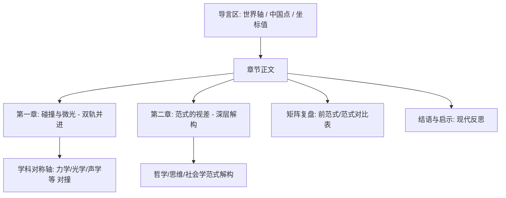

# 《坐标》项目结构与文字风格指南（基于 Part 1 重构沉淀）

本指南基于 **Part 1** （`website/docs/part1.md`）的成功重构实践总结而成，旨在为后续章节（Part 2–6）的优化与风格改写提供统一的规范与执行标准。

---

## 📐 1. 结构规范 (Structural Schema)

每个 Part 的文档结构应保持高度统一，分为以下四个核心层级：

### 层级细节定义：

1.  **导言区（“三位一体”坐标系）**：
    *   **一诗/一言**：在最顶部使用一句极具代表性的中/西历史文献引文（Markdown blockquote）。
    *   **插画**：使用 `pathname:///img/partX_illustration.png` 格式引入示意图。
    *   **世界轴 (World Axis)**：三五百字，概述此历史时期西方物理学（世界轴）的发展主线与范式变迁。
    *   **中国点 (China Point)**：三五百字，概述此历史时期中国经验物理（中国点）的代表性发现与技术成果。
    *   **坐标值 (Coordinate Value)**：分析中西在此阶段的平行/相交状态，直接点出导致后续历史视差的物理与社会学根源。
2.  **第一章：碰撞与微光——经典物理领域的双轨并进**：
    *   **学科对称轴（贴身肉搏）**：改变“先中国、后西方”的割裂布局。将正文按物理学分支（力学与宇宙观、光学与空间、声学与波/数理等）分为若干节。
    *   在每一节内，第一子标题为**西方背景**（如亚里士多德力学、欧氏几何光学、毕达哥拉斯音程），后续子标题为**中国对应点**（如墨经、张衡、沈括、朱载堉等），在同一小节内直接进行物理概念上的交锋。
3.  **第二章：范式的视差——近代科学前夜的深层解构**：
    *   从物理学表象深入到哲学与社会学层面。固定包含以下三个维度的剖析：
        *   **思维分野**：如西方“形式逻辑与公理化几何” VS 中国“辩证名辩与关联性认知”。
        *   **自然观底色**：如西方“还原论/机械论” VS 中国“气论/有机整体论”。
        *   **社会学建构**：如西方“大学自治/学术经院辩论” VS 中国“科举制度/实用主义驱动/官方垄断”。
4.  **矩阵复盘与结语**：
    *   **对比矩阵**：在结语正上方设立独立小节，使用表格直观对比该历史阶段中西在物质观、因果律、工具及知识形态上的差异。
    *   **结语与启示**：从“现代教育与科学思维反思”的角度进行收拢（分条列出，如整体观与还原论的结合、纯粹好奇心等）。
    *   **References**：列出严谨的典籍与学术文献引用。

---

## ✍️ 2. 文字风格规范 (Writing Style Guide)

### 规范一：宏大理性的历史同理心 (Grand & Rational Tone)
*   **要求**：文字必须客观严谨。严禁使用情绪化、主观煽情的字眼（如“全面领先”、“领先西方千余年”、“令人无比自豪”）。
*   **写法示例**：将中国的发现定位为“杰出的经验实证与物理直觉”，同时客观指出其“未能形成逻辑自洽、公理化推演的理论网络”的范式局限。

### 规范二：文白交织的雅致叙事 (Elegant Literary Style)
*   **要求**：白话文表述要雅致、凝练，历史纵深感强；引用古文要点到为止，后面必须紧跟极具文采的物理与哲学分析，拒绝流水账。
*   **写法示例**：
    > *“先秦墨家在大变革时代点燃的理性逻辑与力学火花，在秦汉大一统后逐渐隐没于主流学术视野……要理解中国经验物理的真实力量，我们需要从学者的书斋走向百工的作坊。”*

### 规范三：现代硬核物理术语的“跨时空解构” (Modern Physical Deconstruction)
*   **要求**：拒绝“强行贴金（Anachronism）”，但必须使用精准的现代力学、动力学、声学、应力光学等硬核物理术语，穿透古文表象，解析其物理本质。
*   **词汇库推荐**：
    *   *力学*：惯性质量 (Inertial mass)、倒立摆 (Inverted pendulum)、临界平衡状态 (Critical equilibrium)、非线性动力学传感 (Nonlinear dynamical sensing)、应力波传播 (Stress wave propagation)、纵向共振 (Longitudinal resonance)。
    *   *光学*：非均匀应力松弛 (Differential stress relaxation)、曲率微畸变 (Micro-curvature distortion)、光程偏角放大 (Angular amplification over optical path)。
    *   *声学*：边缘效应 (Edge effect)、辐射阻抗 (Radiation impedance)、谐波失真 (Harmonic distortion)。

### 规范四：强逻辑链条与叙事过渡 (Cohesive Logical Transitions)
*   **要求**：章节、段落之间绝对不能生硬跳转。必须使用**“问题演进”或“思维跨越”**的线索进行承接。
*   **写法示例**：
    > *“如果说张衡的地动仪是汉代机械力学的一次孤立高峰，那么到了宋代，随着印刷术的普及与市民经济的繁荣，对自然物理现象的探索开始从国家礼器走向士大夫阶层的广泛观察……”*

### 规范五：硬核提示框的 LaTeX 公式化升级 (Math-infused Alert Boxes)
*   **要求**：文档中的 `[!TIP]`、`[!IMPORTANT]` 或 `[!NOTE]` 提示框不能只做背景介绍，必须承载**具体的数理公式推导、实验复现数据或定量计算对比**。
*   **公式排版**：行内公式 ` $...$ ` 和行间公式 `$$...$$` 的外侧必须补全空格，避免 MDX 渲染失败。
*   **公式示例**：管口阻抗校正 $L_{eff} = L_{phys} + \Delta L$ 配合异径律公式 $D_n = D_0 \cdot q^{-n/2}$。
